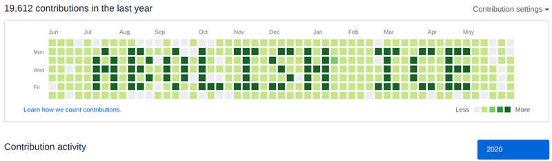

# Make your contributor graph say Abolish ICE



## Usage

1. Create a new repo.  I like `abolish-ice`
1. Run it.

```sh
./paint.sh
```

### Mine is hard to read

The script needs to generate many more commits than your busiest days to make a loud and clear statement.  The `$I` variable determines the number of commits.  If your graph does not turn a crisp, dark green "ABOLISH ICE,"" try increasing `$I`.

## Credit

Bootstrapped from [github-graffiti](https://github.com/mavrk/github-graffiti).
